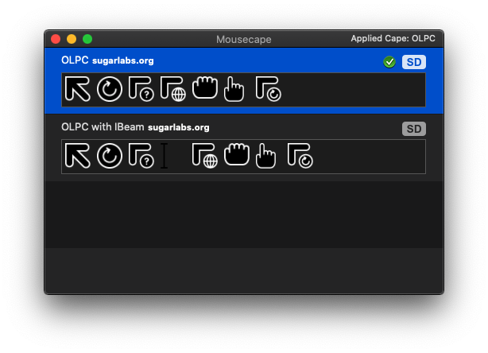

# olpc-mousecape

The thicc One Laptop Per Child / [sugar](https://www.sugarlabs.org) cursor, taken from [sugarlabs/artwork](https://github.com/sugarlabs/sugar-artwork), and repackaged as a macOS Mousecape. A batch file to install the cursors under Microsoft Windows is also provided. 

## Installation

### macOS

- Install [Mousecape](https://github.com/alexzielenski/Mousecape).

- Download and open `olpc-mousecape.cape`. 

### Windows

- Download `olpc-cursor-windows.zip`.

- Unzip and run `olpc-cursor-apply.bat`.
